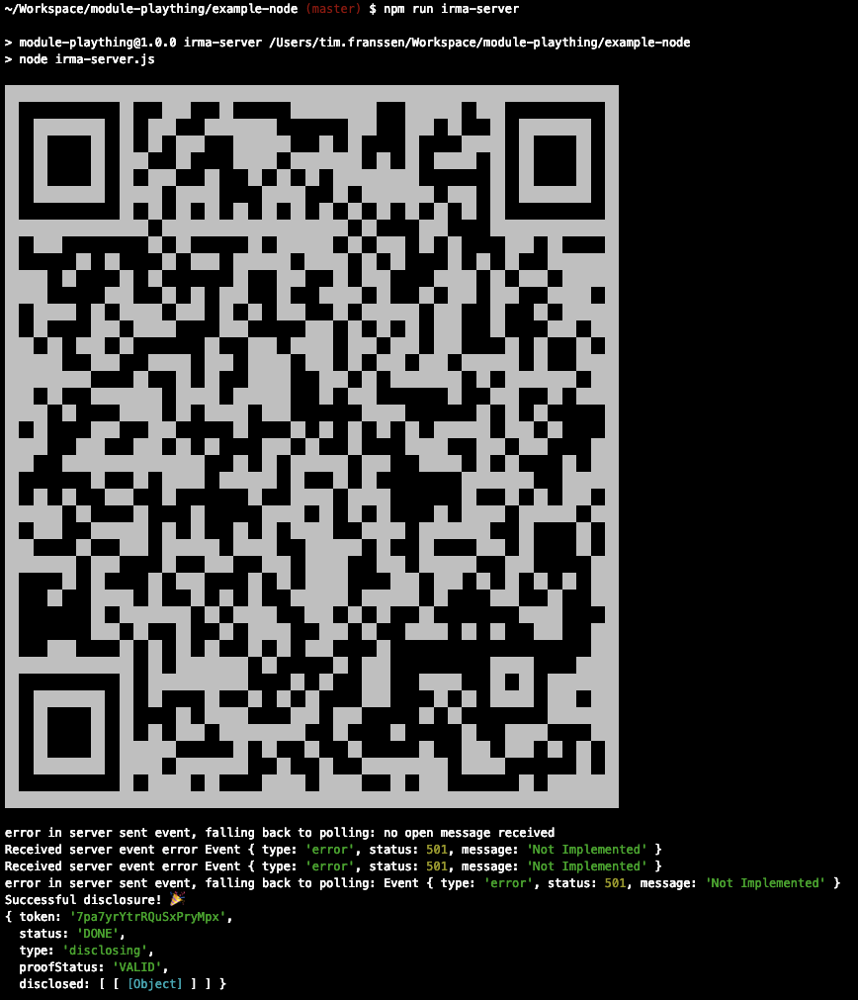
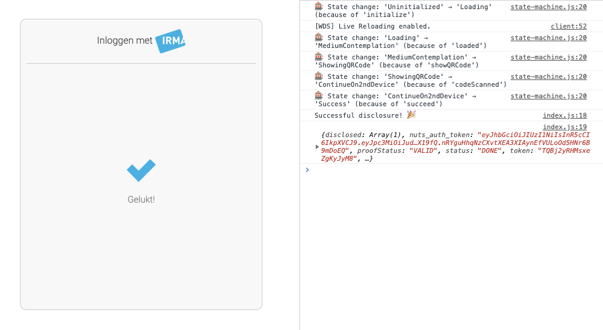

# Proposal

This is a proposal for how to bring `irmajs` and `irma-web-glue` together, and
give developers an easy to use but more flexible interface for integrating IRMA
into their applications.

## Context

`irmajs` makes for quick adoption of IRMA. Just include one Javascript file and
be done with it. It then communicates with an IRMA server for you, and renders a
simple but effective popup in the browser.

However, if you want to have more control over what gets rendered in the browser
or you need to do something special with regards to your IRMA server, you're out
of luck. It couples those things pretty tightly.

So `irma-web-glue` was born, which uses the nodejs-mode of `irmajs` to basically
only use its back-end communication logic. Otherwise, `irma-web-glue` does its
own thing with regards to DOM manipulation. You can also swap `irmajs` out
completely and use it to communicate with a Nuts node, but have the same user
experience in the browser.

However, `irma-web-glue` is getting big. It includes all possible dependencies
for all front-end and back-end plugins. So that doesn't scale very well. Also,
it doesn't expose all security features of `irmajs`. And because it depends on
`irmajs` we have to build a new version of `irma-web-glue` for each release of
`irmajs`.

## A solution

What I'm proposing is that we use the flexibility and the state machine of
`irma-web-glue`, but spread it out over several (small) packages. We then cut
`irmajs` into two pieces (two packages), one for the back-end communication and
one for the front-end popup.

Users of these packages can then include each part independently as a dependency:

```javascript
const IrmaCore   = require('irma-core');
const Console    = require('irma-console');
const IrmaServer = require('irma-irmaserver');
```

...and mix and match plugins as needed:

```javascript
const irma = new IrmaCore();
irma.use(IrmaServer);
irma.use(Console);
```

`irma-core` holds the state machine and some helper logic. `irma-irmaserver` is
a plugin that knows how to communicate with IRMA server (basically half of
`irmajs`). `irma-console` is a plugin that provides a user interface on the
console.

When the state machine is started, each plugin gets state change updates, can do
its work and/or move the machine to the next state.

Starting the disclosure flow is the same as it is in `irma-web-glue` (and
almost the same as it is in `irmajs`):

```javascript
irma.start('http://localhost:8088', {
  "@context": "https://irma.app/ld/request/disclosure/v2",
  "disclose": [
    [
      [ "pbdf.pbdf.email.email" ]
    ]
  ]
})
.then(result => console.log("Successful disclosure! 🎉", result))
.catch(error => console.error("Couldn't do what you asked 😢", error));
```

Don't want console output, but a proper UI in the browser? Use the `irma-web`
package, or the `irma-popup` package that's underway, that packages the other
half of `irmajs`.

Don't want to use the IRMA server, but a Nuts node with built in IRMA server?
Use the `irma-nuts-auth` package instead.

Want to do something completely different? Write your own plugin, which can be
as powerful as any other 🌈

## Examples

### nodejs with IRMA server

```javascript
const IrmaCore   = require('irma-core');
const Console    = require('irma-console');
const IrmaServer = require('irma-irmaserver');

const irma = new IrmaCore();

irma.use(Console);
irma.use(IrmaServer);

irma.start('http://localhost:8088', {
  "@context": "https://irma.app/ld/request/disclosure/v2",
  "disclose": [
    [
      [ "pbdf.pbdf.email.email" ]
    ]
  ]
})
.then(result => console.log("Successful disclosure! 🎉", result))
.catch(error => console.error("Couldn't do what you asked 😢", error));
```

#### Result



### Webbrowser with Nuts Auth (and console debug output)

```javascript
const IrmaCore     = require('irma-core');
const IrmaWeb      = require('irma-web');
const IrmaNutsAuth = require('irma-nuts-auth');

const irma = new IrmaCore({
  debugging: true,
  element:   '#irma-web-form'
});

irma.use(IrmaWeb);
irma.use(IrmaNutsAuth);

irma.start('http://localhost:21323', {
  type: "BehandelaarLogin",
  language: "NL",
  version: "v1"
})
.then(result => console.log("Successful disclosure! 🎉", result))
.catch(error => console.error("Couldn't do what you asked 😢", error));
```

#### Result



## State of the actual software in this repo

I cobbled this together over the course of a couple of days, with bits and
pieces copied'n'pasted from `irma-web-glue` and `irmajs`. For most of it the
happy path actually works, but there's a lot to improve on error handling. Also,
the code isn't the most consistent yet.

## Path forward

But before we dive into fixing all edge cases and style issues, let's first
discuss the concepts in this proposal. Specifically:

* Do you guys agree that it's a good idea to have many small packages instead of
one (or two) big one(s)?
* If so, where should these packages live? I would guess in separate Github
repositories. Do we want to have those repositories in the privacybydesign
Github org, in the nuts-foundation Github org, or spread over the two? I think
I'd be in favour of the latter, but keep a list somewhere on the IRMA website of
known available plugins.
* Do you agree with the concept of having multiple plugins subscribing to a
state machine?
* Do you agree with the API `irma-core` exposes to the developer?
* Do we still want to have a "legacy" `irmajs` package? That could just
'webpack' a couple of these plugins, I guess. Or we could just deprecate that
one (and `irma-web-glue`) and encourage people to move to the new version..?

If we can find agreement on these things, I don't mind putting some more time
in, and bringing this to a first stable version. I'll definitely need your help
in testing and bugfixing everything though.
